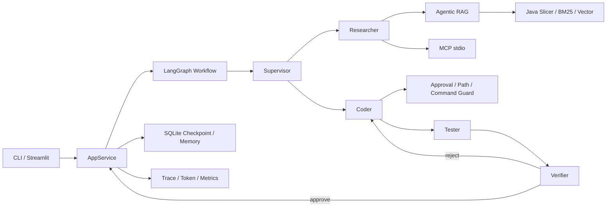
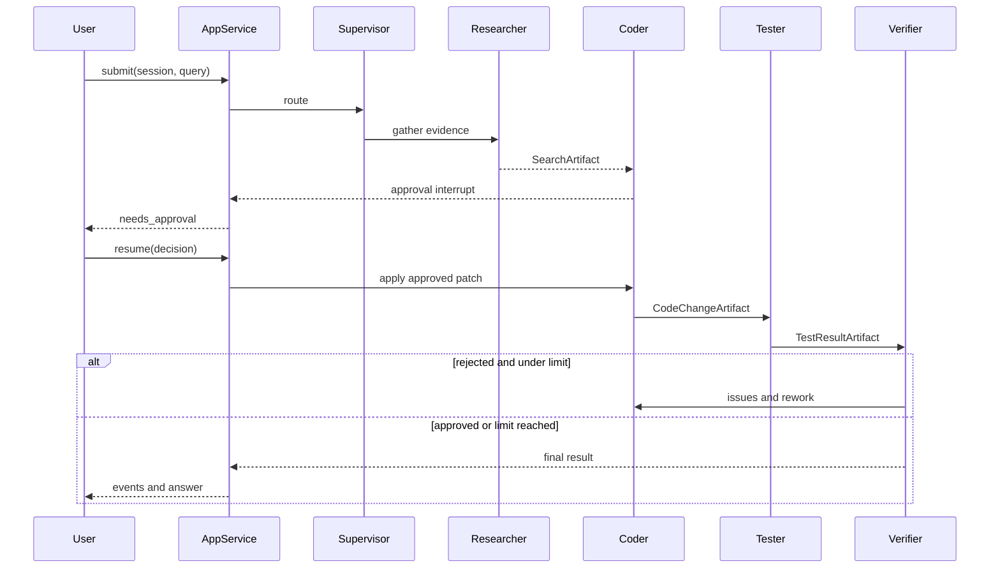

# 架构说明

## 组件关系

UI 不直接操作 LangGraph、ToolRegistry 或 RAG。CLI 和 Streamlit 都通过共享运行时工厂创建 `AppService`，因此审批、事件、Session 和 Trace 语义一致。

## 写任务数据流

## 状态与持久化

- LangGraph Checkpoint 保存可恢复工作流状态和审批中断。
- Session 元数据与事件 JSONL 支持 UI/CLI 重启后恢复。
- 代码索引按仓库路径哈希隔离，并根据文件哈希增量更新。
- Trace 独立于工作流 State，通过 ContextVar 隔离 Session。
- 长期记忆只保存偏好、约定和决策；代码事实每次从仓库重新验证。

## 安全边界

- 所有文件路径必须位于仓库根目录。
- 写工具在执行前触发人工审批。
- Researcher、Coder、Tester、Verifier 使用不同权限集合。
- 构建命令使用白名单、超时和输出上限。
- 日志脱敏密钥、Prompt、源码和 Patch 内容。
- 系统不自动执行 `git commit` 或 `git push`。
- Docker 以非 root 用户运行，不挂载 Docker Socket，并限制资源。

## 评估隔离

评估不会修改 `demo-repo` 原件。每个任务复制到独立临时目录，注入任务前置状态，初始化 Git 基线，运行 Agent、编译、测试和断言，最后处理 Windows Git 只读对象并删除目录。
